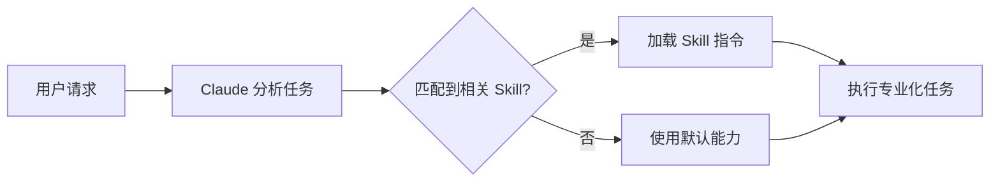

# Claude Skills 完全指南:让 AI 助手真正理解你的工作流

## 什么是 Claude Skills?

Claude Skills 是 Anthropic 在 2025 年推出的一项革命性功能,它允许用户通过模块化的方式扩展 Claude 的能力。简单来说,Skills 就是一套可以被 Claude 自主调用的专业化指令集,让 AI 助手能够针对特定任务提供更专业、更精准的帮助。

想象一下:你不再需要每次都详细解释你的需求、项目规范或工作流程。通过 Skills,Claude 可以自动理解你的工作场景,并在合适的时机应用相应的专业知识。

## 核心特性

### 1. 模型自主调用

这是 Skills 最强大的特性。与传统的命令式工具不同,Skills 是**模型驱动**的:

- Claude 会在启动时预加载所有已安装 Skills 的名称和描述
- 当你发起请求时,Claude 会根据任务性质自主判断是否需要调用某个 Skill
- 你无需手动触发,一切都是自然而然发生的



### 2. 轻量级结构

一个 Skill 的最小结构非常简单,只需要一个 `SKILL.md` 文件:

```markdown
---
name: my-skill
description: 这个 Skill 的简短描述
---

# Skill 详细指令

在这里写下 Claude 应该如何处理相关任务的详细说明...
```

**关键点:**
- **YAML 前置元数据**:包含 `name` 和 `description` 字段
- **Markdown 内容**:包含具体的指令、示例、最佳实践等
- **可选文件**:可以包含脚本、模板、配置文件等支持资源

### 3. 双层存储机制

Skills 支持两种安装位置:

- **全局 Skills** (`~/.claude/skills/`):适用于所有项目的通用能力
- **项目 Skills** (`.claude/skills/`):特定项目的专业化指令

这种设计让你可以:
- 在全局层面定义通用技能(如代码审查规范、文档编写标准)
- 在项目层面定义特定规则(如项目架构约定、团队编码风格)

### 4. 官方文档 Skills

Anthropic 提供了一套开箱即用的专业 Skills:

- **Excel Skills**:创建包含公式、图表的专业电子表格
- **PowerPoint Skills**:生成结构化的演示文稿
- **Word Skills**:编写格式规范的文档
- **PDF Skills**:生成可填写的 PDF 表单

## 实际应用场景

### 场景 1: React 开发规范

假设你的团队有特定的 React 开发规范:

```yaml
---
name: react-team-standards
description: 团队 React 开发规范和最佳实践
---

# React 开发规范

## 组件结构
- 使用函数组件和 Hooks
- Props 必须定义 TypeScript 接口
- 复杂状态使用 useReducer 而非 useState

## 文件组织
- 组件文件最大 500 行
- 每个组件独立文件夹
- 样式使用 CSS Modules

## 命名约定
- 组件使用 PascalCase
- Hooks 使用 camelCase 并以 use 开头
- 事件处理器以 handle 开头
```

安装这个 Skill 后,Claude 在帮你写 React 代码时会自动遵循这些规范,无需你每次提醒。

### 场景 2: API 文档生成

创建一个专门生成 API 文档的 Skill:

```yaml
---
name: api-doc-generator
description: 根据代码自动生成符合团队标准的 API 文档
---

# API 文档生成规范

## 文档结构
1. 端点概述
2. 请求参数说明
3. 响应格式示例
4. 错误码说明
5. 使用示例(curl + JavaScript)

## 格式要求
- 使用 OpenAPI 3.0 规范
- 包含实际的请求/响应示例
- 标注必填/可选参数
```

### 场景 3: 代码审查助手

```yaml
---
name: code-review-checklist
description: 代码审查检查清单
---

# 代码审查要点

## 安全性
- [ ] 是否有 SQL 注入风险
- [ ] 是否正确处理用户输入
- [ ] 敏感信息是否加密

## 性能
- [ ] 是否有 N+1 查询
- [ ] 是否合理使用缓存
- [ ] 大数据集是否分页

## 可维护性
- [ ] 命名是否清晰
- [ ] 是否有过长函数(>50行)
- [ ] 是否有重复代码
```

## 为什么 Skills 比 MCP 更强大?

有技术专家评价 "Claude Skills 可能比 MCP(Model Context Protocol)更重要"。原因在于:

| 特性 | Skills | MCP |
|------|--------|-----|
| 调用方式 | AI 自主判断 | 需要明确触发 |
| 学习曲线 | 极低(Markdown) | 中等(需要编程) |
| 适用场景 | 工作流程、规范、标准 | 工具集成、外部服务 |
| 上下文效率 | 按需加载 | 持续占用 |

**关键区别:**
- **MCP** 像是给 Claude 装上"手脚",让它能操作外部工具
- **Skills** 像是给 Claude 注入"专业知识",让它变成领域专家

两者结合使用才能发挥最大价值。

## 如何创建自己的 Skill?

### 步骤 1: 创建文件结构

```bash
# 全局 Skill
mkdir -p ~/.claude/skills/my-skill
touch ~/.claude/skills/my-skill/SKILL.md

# 项目 Skill
mkdir -p .claude/skills/my-skill
touch .claude/skills/my-skill/SKILL.md
```

### 步骤 2: 编写 SKILL.md

```markdown
---
name: typescript-expert
description: TypeScript 高级开发和类型系统专家
---

# TypeScript 高级开发指南

## 类型定义原则
- 优先使用 `type` 而非 `interface`(除非需要扩展)
- 使用 `unknown` 而非 `any`
- 善用 `const assertions` 和 `as const`

## 常见模式
### 条件类型
\`\`\`typescript
type NonNullable<T> = T extends null | undefined ? never : T
\`\`\`

### 映射类型
\`\`\`typescript
type Readonly<T> = {
  readonly [P in keyof T]: T[P]
}
\`\`\`

## 性能优化
- 避免过深的类型嵌套
- 使用类型别名简化复杂类型
- 合理使用泛型约束
```

### 步骤 3: 测试 Skill

重启 Claude Code,然后尝试询问 TypeScript 相关问题:

```
你: 帮我优化这段 TypeScript 代码的类型定义

Claude 会自动应用 typescript-expert Skill 的指导原则
```

## 高级技巧

### 1. Skill 组合

创建多个小而专注的 Skills,让 Claude 根据需要组合使用:

```
.claude/skills/
├── architecture/           # 架构设计规范
├── testing/               # 测试策略
├── security/              # 安全检查清单
└── documentation/         # 文档编写标准
```

### 2. 包含可执行脚本

Skills 可以包含 Claude 可以执行的脚本:

```
my-skill/
├── SKILL.md
├── scripts/
│   ├── validate.py
│   └── format.sh
└── templates/
    └── component.template.tsx
```

在 SKILL.md 中引用:

```markdown
当需要验证代码时,执行 `scripts/validate.py`
当需要创建组件时,使用 `templates/component.template.tsx` 作为基础
```

### 3. 动态上下文

使用变量和占位符让 Skill 更灵活:

```markdown
---
name: project-context
description: 项目特定上下文和配置
---

# 项目信息
- 技术栈: {{TECH_STACK}}
- 目标用户: {{TARGET_USERS}}
- 代码规范: 参考 .eslintrc 和 .prettierrc

根据当前文件路径调整建议:
- `src/components/`: UI 组件开发建议
- `src/services/`: API 服务层建议
- `src/utils/`: 工具函数建议
```

## 最佳实践

### ✅ 应该做的

1. **保持 description 简洁准确**:这是 Claude 判断是否使用该 Skill 的关键
2. **一个 Skill 专注一个领域**:不要创建"万能 Skill"
3. **提供具体示例**:比抽象原则更有效
4. **定期更新**:随着项目演进更新 Skills
5. **团队共享**:将项目 Skills 提交到版本控制

### ❌ 不应该做的

1. **不要写过长的 Skill**:超过 1000 行的 Skill 会影响性能
2. **不要重复基础知识**:Claude 已经掌握的通用知识无需重复
3. **不要硬编码敏感信息**:如 API 密钥、密码等
4. **不要创建冲突的 Skills**:多个 Skill 给出矛盾指令会让 Claude 困惑

## 与 CLAUDE.md 的区别

很多人会困惑:Skills 和 `.claude/CLAUDE.md` 有什么区别?

| 特性 | CLAUDE.md | Skills |
|------|-----------|--------|
| 用途 | 全局项目指令 | 模块化专业能力 |
| 加载时机 | 总是加载 | 按需加载 |
| 适合内容 | 项目架构、通用规范 | 特定领域知识 |
| 上下文开销 | 持续占用 | 仅在使用时占用 |

**建议组合使用:**
- `CLAUDE.md`: 定义项目基础信息、架构概览、通用规范
- `Skills`: 定义具体领域的深度指令

## 可用性

Claude Skills 目前对以下用户开放:
- ✅ Pro 用户
- ✅ Max 用户
- ✅ Team 用户
- ✅ Enterprise 用户

## 社区资源

- **官方仓库**: [github.com/anthropics/skills](https://github.com/anthropics/skills)
- **Awesome Skills**: [github.com/travisvn/awesome-claude-skills](https://github.com/travisvn/awesome-claude-skills)
- **官方文档**: [docs.claude.com/en/docs/claude-code/skills](https://docs.claude.com/en/docs/claude-code/skills)

## 实际案例:本项目的 Skills

如果你正在开发一个 React 项目,可以创建这样的 Skill:

```markdown
---
name: react-developer
description: React 19 + TypeScript 项目开发规范和最佳实践
---

# React 开发规范

## 技术栈
- React 19 + TypeScript
- React Router v7
- Vite + pnpm
- SCSS

## 组件开发
- 优先使用函数组件
- Props 必须有 TypeScript 接口
- 使用 React 19 新特性(如 use hook)

## 样式规范
- 全局样式: app/styles/global.scss
- 组件样式: 独立 SCSS 文件
- 避免内联样式

## 文件组织
- 路由文件: app/routes/
- 组件: app/components/
- 单文件不超过 500 行

## 代码质量
- 使用 pnpm lint 检查
- 清晰的变量命名
- 完善的错误处理
```

## 总结

Claude Skills 代表了 AI 辅助编程的一个重要进化方向:**从通用助手到领域专家**。通过简单的 Markdown 文件,你可以:

- 🎯 **让 AI 理解你的工作方式**:无需每次重复说明
- 🚀 **提升协作效率**:团队共享的 Skills 确保一致性
- 🧩 **模块化知识管理**:不同领域的专业知识独立管理
- 💡 **持续优化工作流**:随时更新和改进 Skills

最重要的是,Skills 的学习曲线极低 —— 如果你会写 Markdown,你就会创建 Skills。

现在就开始创建你的第一个 Skill,让 Claude 真正成为你的专属 AI 助手!

---

*本文基于 2025 年 Claude Skills 最新特性编写*
