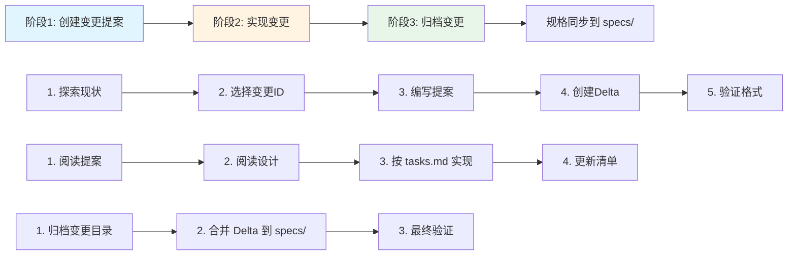
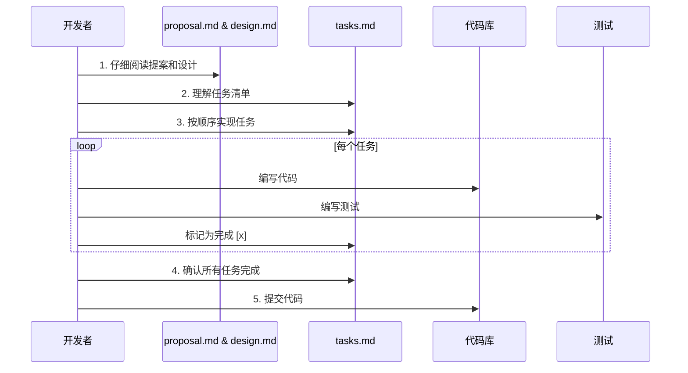

# OpenSpec 实战指南:让AI成为你的最佳编程伙伴

## 一、为什么需要 OpenSpec?

### 传统开发的三大痛点

你是否遇到过这样的场景:

**场景一:需求迷失**
> 团队花了两周时间开发新功能,上线后发现和产品经理的预期完全不同。原因?最初的需求文档早已被遗忘在某个角落,开发过程中需求变更了3次,但没人记得更新文档。

**场景二:AI生成的代码一团糟**
> 你满怀期待地让 AI 助手帮你写代码,结果生成的代码虽然能跑,但架构混乱、风格不一致、缺少错误处理。你花了更多时间修改 AI 生成的代码,还不如自己从头写。

**场景三:技术债务累积**
> 项目进行到第6个月,代码库已经有15000行代码,但没人说得清楚每个模块的确切职责。新人入职需要2周才能理解代码结构,添加新功能总是担心破坏现有逻辑。

这些问题的根源是什么?**缺乏一个权威的、可维护的、实时同步的规格说明(Specification)**。

### 规格驱动开发(Spec-Driven Development)的崛起

2025年,软件工程领域正在发生一场静悄悄的革命。OpenAI 的工程师 Sean Grove 在 AI Engineer 大会上说:"规格说明,而不是提示词或代码,正在成为编程的基本单位。编写规格说明是新时代的超能力。"

**数据说话:**
- GitHub 在2025年9月发布的 Spec Kit 工具,两个月内获得超过8000+ stars
- Microsoft、Anthropic、AWS 等科技巨头纷纷推出支持规格驱动开发的工具
- 采用规格驱动开发的团队,AI 代码生成质量提升 60%,bug 率降低 45%

但市面上的工具要么过于复杂(学习成本高),要么过于简陋(缺乏完整工作流支持)。

**这就是 OpenSpec 诞生的理由。**

### OpenSpec 的设计哲学

OpenSpec 是一个轻量级的规格驱动开发工作流框架,核心理念可以用三句话概括:

1. **规格是唯一的真相源(Single Source of Truth)** - 所有需求、设计决策、实现细节都源于规格
2. **变更是一等公民(Changes as First-Class Citizens)** - 每次功能添加、修改、重构都通过正式的变更提案流程
3. **AI 友好,人类可读(AI-Friendly, Human-Readable)** - 使用结构化的 Markdown 格式,既能让 AI 精准理解,也能让人轻松阅读

OpenSpec 不是一个庞大的工具,而是一套最佳实践 + 一个简单的 CLI。它的目标是:**让你在使用 AI 编程时,获得传统软件工程的严谨性,同时保持敏捷开发的灵活性**。

---

## 二、OpenSpec 核心概念详解

### 2.1 目录结构:一切井然有序

OpenSpec 的目录结构极其简洁,但蕴含深意:

```
openspec/
├── project.md              # 项目宪章:不可撼动的原则
├── specs/                  # 当前真相:已部署的功能规格
│   └── [capability]/       # 单一能力单元
│       ├── spec.md         # 需求和场景
│       └── design.md       # 技术模式和架构决策
├── changes/                # 变更提案:即将发生的改变
│   ├── [change-name]/
│   │   ├── proposal.md     # 为什么改?改什么?影响范围?
│   │   ├── tasks.md        # 实现清单
│   │   ├── design.md       # 技术决策(可选)
│   │   └── specs/          # 规格增量变更
│   │       └── [capability]/
│   │           └── spec.md # ADDED/MODIFIED/REMOVED
│   └── archive/            # 已完成的变更历史
```

#### 理解三个核心目录

**1. `specs/` - 已部署功能的规格说明**

这里存放的是**当前生产环境**中已经实现的功能规格。每个子目录代表一个"能力单元(capability)",例如:
- `specs/user-auth/` - 用户认证能力
- `specs/payment-processing/` - 支付处理能力
- `specs/data-export/` - 数据导出能力

> **金科玉律:** specs/ 目录必须始终反映生产环境的真实状态。如果代码已经部署,规格必须同步更新。

**2. `changes/` - 变更提案目录**

这里存放的是**正在规划或实现中**的功能变更。每个变更都有唯一的 ID(如 `add-two-factor-auth`),包含完整的提案文档和规格增量。

> **关键区别:** changes/ 是"将要成为什么",specs/ 是"现在是什么"。

**3. `changes/archive/` - 变更历史档案**

已完成的变更会被移动到这里,保留历史记录。档案目录按日期命名,如 `2025-10-31-add-two-factor-auth/`。

> **最佳实践:** 永远不要删除 archive/,它是项目演进的宝贵历史记录。

### 2.2 Capability(能力单元):如何划分功能

OpenSpec 使用"能力单元"作为组织规格的基本单位。但如何定义一个合理的 capability?

#### 划分原则

**✅ 好的 capability 设计:**

```
user-auth/           # 用户认证(单一职责)
├── spec.md
└── design.md

payment-capture/     # 支付捕获(动词-名词结构)
├── spec.md
└── design.md

notification-email/  # 邮件通知(明确边界)
├── spec.md
└── design.md
```

**❌ 糟糕的 capability 设计:**

```
backend/             # 太宽泛,没有明确边界
├── spec.md

user-and-admin/      # 包含"AND",说明职责不单一
├── spec.md

utils/               # 工具类,不是业务能力
├── spec.md
```

#### 黄金法则:"10分钟可理解性"

一个好的 capability 应该满足:
1. 新成员阅读 `spec.md` 10分钟内能理解其职责
2. 描述时不需要使用"AND"连接多个职责
3. 修改这个 capability 不会影响其他 capability 的核心逻辑

**实战案例:**

假设你在开发一个电商系统,需要实现"订单管理"功能。不要创建一个巨大的 `order-management/` capability,而应该拆分为:

- `order-creation/` - 订单创建
- `order-payment/` - 订单支付
- `order-fulfillment/` - 订单履约
- `order-cancellation/` - 订单取消

每个 capability 都有清晰的边界,可以独立演进。

### 2.3 Spec.md 格式:需求的标准表达

OpenSpec 的 `spec.md` 文件使用一种结构化的 Markdown 格式,核心是**需求(Requirement) + 场景(Scenario)**。

#### 基本结构

```markdown
## Requirements

### Requirement: 用户登录
系统必须(SHALL)提供用户名和密码登录功能。

#### Scenario: 登录成功
- **WHEN** 用户输入正确的用户名和密码
- **THEN** 系统返回 JWT token
- **AND** 重定向到用户主页

#### Scenario: 登录失败
- **WHEN** 用户输入错误的密码
- **THEN** 系统返回 401 错误
- **AND** 提示"用户名或密码错误"
```

#### 关键要点

**1. Requirement 使用 SHALL/MUST 关键词**

- SHALL/MUST - 强制性需求(normative)
- SHOULD - 推荐性需求(可选但强烈建议)
- MAY - 完全可选的需求

**2. 每个 Requirement 必须至少有一个 Scenario**

Scenario 是需求的可验证表达。没有 Scenario 的 Requirement 是不完整的,因为无法验证是否满足需求。

**3. Scenario 格式必须严格遵守**

✅ **正确格式:**
```markdown
#### Scenario: 描述性名称
- **WHEN** 前置条件
- **THEN** 预期结果
- **AND** 额外的结果
```

❌ **错误格式:**
```markdown
- **Scenario: 名称**        # 不要用列表项
**Scenario**: 名称          # 不要用粗体冒号
### Scenario: 名称          # 不要用三级标题
```

> **血泪教训:** OpenSpec CLI 的 Scenario 解析器对格式非常严格。使用错误格式会导致验证失败,且错误提示不明显。务必使用 `####` 四级标题。

### 2.4 Delta 机制:增量式的变更管理

OpenSpec 的精髓在于**增量变更(Delta)**机制。当你要修改一个现有的 capability 时,不是直接修改 `specs/[capability]/spec.md`,而是在 `changes/[change-id]/specs/[capability]/spec.md` 中写入增量变更。

#### 四种 Delta 操作

**1. ADDED - 新增需求**

用于添加全新的功能需求:

```markdown
## ADDED Requirements

### Requirement: 双因素认证
用户必须在登录后提供第二因素验证。

#### Scenario: OTP 验证成功
- **WHEN** 用户输入正确的 OTP 码
- **THEN** 系统完成登录流程
```

**2. MODIFIED - 修改需求**

用于修改现有需求的行为:

```markdown
## MODIFIED Requirements

### Requirement: 用户登录
系统必须提供用户名和密码登录功能,并支持 OAuth2 第三方登录。

#### Scenario: 登录成功
- **WHEN** 用户输入正确的用户名和密码
- **THEN** 系统返回 JWT token
- **AND** 重定向到用户主页

#### Scenario: OAuth2 登录成功
- **WHEN** 用户通过 Google OAuth2 授权
- **THEN** 系统创建或关联账户
- **AND** 返回 JWT token
```

> **关键注意:** MODIFIED 必须包含完整的需求内容(原有的 + 新增的)。归档时,OpenSpec 会用这个完整内容替换原需求。

**3. REMOVED - 删除需求**

用于废弃不再需要的功能:

```markdown
## REMOVED Requirements

### Requirement: 用户名登录
**Reason**: 为了提高安全性,强制使用邮箱登录
**Migration**: 用户需要在下次登录时绑定邮箱,旧的用户名将不再有效
```

**4. RENAMED - 重命名需求**

仅用于需求名称变更,不改变行为:

```markdown
## RENAMED Requirements
- FROM: `### Requirement: 用户登录`
- TO: `### Requirement: 用户身份认证`
```

#### Delta 最佳实践

**何时使用 ADDED vs MODIFIED?**

这是初学者最常犯的错误。判断标准:

- **ADDED:** 新功能是正交的(orthogonal),可以独立存在
- **MODIFIED:** 修改了现有需求的行为、范围或验收标准

**案例分析:**

假设现有需求:
```markdown
### Requirement: 用户登录
系统必须提供用户名和密码登录功能。
```

**情况1: 添加 OAuth2 登录**
- 如果 OAuth2 是替代方案,修改了登录行为 → 使用 **MODIFIED**
- 如果 OAuth2 是额外选项,原有登录不变 → 可以使用 **ADDED**(新增"OAuth2 登录"需求)

**情况2: 添加记住我功能**
- "记住我"是登录流程的扩展,修改了登录行为 → 使用 **MODIFIED**

**情况3: 添加登录日志**
- 日志是正交功能,不改变登录本身 → 使用 **ADDED**(新增"登录审计日志"需求)

---

## 三、OpenSpec 完整工作流实战

### 3.1 三阶段工作流概览



### 3.2 阶段1: 创建变更提案

#### 步骤0: 判断是否需要提案

**无需提案的情况(直接修改代码):**
- ✅ Bug 修复(恢复原有规格的行为)
- ✅ 拼写错误、格式调整、注释修改
- ✅ 非破坏性依赖更新
- ✅ 配置文件调整
- ✅ 为现有行为补充测试

**必须创建提案的情况:**
- ⚠️ 新增功能或能力
- ⚠️ 破坏性变更(API、数据库模式等)
- ⚠️ 架构调整或设计模式变更
- ⚠️ 性能优化(改变行为)
- ⚠️ 安全策略更新

**决策树:**
```
是否改变用户可观察的行为?
├─ 否 → 是否改变开发者 API?
│   ├─ 否 → 是否改变架构模式?
│   │   ├─ 否 → 无需提案,直接修改
│   │   └─ 是 → 需要提案
│   └─ 是 → 需要提案
└─ 是 → 需要提案
```

#### 步骤1: 探索项目现状

在创建新的变更提案前,**必须**了解当前项目状态,避免重复或冲突。

```bash
# 1. 查看所有现有 capability
openspec list --specs

# 示例输出:
# Available Specs:
#   - user-auth
#   - payment-processing
#   - data-export

# 2. 查看正在进行的变更
openspec list

# 示例输出:
# Active Changes:
#   - add-two-factor-auth (affects: user-auth)
#   - refactor-payment-retry (affects: payment-processing)

# 3. 查看特定 capability 的详细内容
openspec show user-auth --type spec

# 4. 全文搜索(使用 ripgrep)
rg -n "Requirement:|Scenario:" openspec/specs
rg -n "^#|Requirement:" openspec/changes
```

**实战技巧:**

假设你要添加"密码重置"功能,搜索步骤:

```bash
# 1. 检查是否已有相关 capability
openspec list --specs | grep -i password
openspec list --specs | grep -i auth

# 2. 查看 user-auth 的现有需求
openspec show user-auth --type spec

# 3. 检查是否有人已经在做类似的变更
openspec list | grep -i password
openspec list | grep -i reset

# 4. 全文搜索是否提到过密码重置
rg -i "password reset" openspec/
```

#### 步骤2: 选择变更ID

变更 ID 是变更提案的唯一标识符,遵循命名约定:

**格式:** `<verb>-<noun>-<noun>` (kebab-case)

**动词前缀推荐:**
- `add-` - 新增功能
- `update-` - 更新现有功能
- `remove-` - 删除功能
- `refactor-` - 重构(不改变外部行为)
- `fix-` - 修复问题(如果需要提案的话)
- `migrate-` - 数据或架构迁移

**✅ 好的变更 ID:**
- `add-two-factor-auth`
- `update-payment-retry-logic`
- `remove-legacy-api-v1`
- `refactor-database-connection`
- `migrate-postgres-to-v15`

**❌ 糟糕的变更 ID:**
- `feature` (太宽泛)
- `update_code` (使用下划线,不是kebab-case)
- `AddTwoFactorAuth` (使用大驼峰)
- `add-2fa` (缩写不清晰,除非项目中通用)

**唯一性检查:**
```bash
# 检查 ID 是否已被使用
ls openspec/changes/ | grep "your-change-id"
ls openspec/changes/archive/ | grep "your-change-id"
```

#### 步骤3: 搭建提案目录结构

```bash
# 设置变更 ID
CHANGE=add-password-reset

# 创建目录结构
mkdir -p openspec/changes/$CHANGE/specs/user-auth

# 创建 proposal.md
cat > openspec/changes/$CHANGE/proposal.md << 'EOF'
## Why
用户经常忘记密码,目前只能联系客服重置,支持成本高。提供自助密码重置功能可以改善用户体验并降低运营成本。

## What Changes
- 添加"忘记密码"入口点
- 实现邮箱验证码发送和验证逻辑
- 提供密码重置表单和安全检查
- 记录密码重置操作日志

## Impact
- Affected specs: user-auth
- Affected code:
  - `src/auth/routes.ts` - 新增 API 端点
  - `src/auth/password-reset.service.ts` - 新服务
  - `src/email/templates/` - 新增邮件模板
  - `frontend/pages/reset-password.tsx` - 新页面
EOF

# 创建 tasks.md
cat > openspec/changes/$CHANGE/tasks.md << 'EOF'
## 1. 后端实现
- [ ] 1.1 创建密码重置令牌表(tokens 表,包含 user_id, token, expires_at)
- [ ] 1.2 实现 POST /auth/reset-password/request 端点(发送验证码)
- [ ] 1.3 实现 POST /auth/reset-password/verify 端点(验证并重置密码)
- [ ] 1.4 添加令牌过期清理定时任务

## 2. 邮件服务
- [ ] 2.1 创建密码重置邮件模板
- [ ] 2.2 实现邮件发送逻辑(集成现有邮件服务)
- [ ] 2.3 添加发送频率限制(同一用户10分钟内只能请求1次)

## 3. 前端实现
- [ ] 3.1 创建"忘记密码"页面
- [ ] 3.2 创建密码重置表单页面
- [ ] 3.3 添加密码强度验证
- [ ] 3.4 实现前端表单验证和错误处理

## 4. 安全和测试
- [ ] 4.1 添加 CSRF 保护
- [ ] 4.2 实现暴力破解防护(IP 级别限流)
- [ ] 4.3 编写单元测试(覆盖核心逻辑)
- [ ] 4.4 编写集成测试(端到端流程)
- [ ] 4.5 安全审计(检查常见密码重置漏洞)
EOF
```

#### 步骤4: 编写规格 Delta

这是最关键的一步。在 `changes/add-password-reset/specs/user-auth/spec.md` 中编写增量变更:

```markdown
## ADDED Requirements

### Requirement: 密码重置请求
系统必须允许用户通过邮箱请求密码重置。

#### Scenario: 请求成功
- **WHEN** 用户输入注册邮箱并请求密码重置
- **THEN** 系统生成唯一的重置令牌(有效期15分钟)
- **AND** 发送包含重置链接的邮件到用户邮箱
- **AND** 返回 200 状态码和"邮件已发送"提示

#### Scenario: 邮箱不存在
- **WHEN** 用户输入的邮箱未注册
- **THEN** 系统仍返回"邮件已发送"提示(防止邮箱枚举攻击)
- **AND** 不实际发送邮件

#### Scenario: 请求频率限制
- **WHEN** 用户在10分钟内第二次请求密码重置
- **THEN** 系统返回 429 状态码
- **AND** 提示"请求过于频繁,请稍后再试"

### Requirement: 密码重置验证
系统必须验证重置令牌并允许用户设置新密码。

#### Scenario: 验证成功并重置密码
- **WHEN** 用户提交有效的重置令牌和符合强度要求的新密码
- **THEN** 系统更新用户密码(使用 bcrypt 加密)
- **AND** 使重置令牌失效
- **AND** 使所有现有会话令牌失效(强制重新登录)
- **AND** 记录密码重置操作日志
- **AND** 发送密码已更改的通知邮件

#### Scenario: 令牌过期
- **WHEN** 用户提交的重置令牌已超过15分钟有效期
- **THEN** 系统返回 400 错误
- **AND** 提示"重置链接已过期,请重新请求"

#### Scenario: 令牌无效
- **WHEN** 用户提交的重置令牌不存在或格式错误
- **THEN** 系统返回 400 错误
- **AND** 提示"重置链接无效"

#### Scenario: 新密码强度不足
- **WHEN** 用户提交的新密码不符合强度要求(少于8个字符或无特殊字符)
- **THEN** 系统返回 400 错误
- **AND** 提示具体的密码要求

### Requirement: 密码重置安全日志
系统必须记录所有密码重置操作以便审计。

#### Scenario: 记录成功操作
- **WHEN** 密码重置成功完成
- **THEN** 系统记录日志包含:用户ID、操作时间、IP地址、User-Agent

#### Scenario: 记录失败尝试
- **WHEN** 密码重置失败(令牌过期、无效等)
- **THEN** 系统记录日志包含:尝试的令牌、失败原因、IP地址
```

**编写 Delta 的黄金法则:**

1. **每个需求至少1个场景,最好3-5个场景** - 覆盖成功、失败、边界情况
2. **场景要可测试** - 能直接翻译成测试用例
3. **明确安全考虑** - 涉及认证、授权、敏感数据的需求必须包含安全场景
4. **考虑边界条件** - 空值、超长输入、并发、网络错误等

#### 步骤5: 创建 design.md(可选)

根据以下标准判断是否需要 `design.md`:

**必须创建 design.md 的情况:**
- ✅ 跨服务/跨模块的变更
- ✅ 引入新的外部依赖(数据库、第三方 API 等)
- ✅ 数据模型有重大变更
- ✅ 涉及安全、性能或合规性的复杂性
- ✅ 需要数据迁移或回滚计划
- ✅ 技术方案有多个可选项,需要记录决策理由

**可以省略 design.md 的情况:**
- ✅ 单一文件的简单修改
- ✅ 纯 UI 调整(不涉及后端)
- ✅ 配置变更
- ✅ 技术方案显而易见,无争议

对于我们的密码重置功能,**需要**创建 design.md:

```markdown
## Context
用户密码重置涉及安全敏感操作,需要平衡安全性和用户体验。现有系统使用 JWT 认证,邮件服务已集成 SendGrid。

## Goals / Non-Goals

**Goals:**
- 提供安全的自助密码重置流程
- 防止常见的密码重置漏洞(邮箱枚举、CSRF、重放攻击)
- 与现有认证系统无缝集成

**Non-Goals:**
- 不支持短信验证码(未来可扩展)
- 不支持安全问题验证(易被社工攻击)

## Decisions

### Decision 1: 令牌存储方式
**选择:** 使用数据库表存储令牌(而非 JWT)

**理由:**
- 需要主动撤销能力(JWT 无法撤销)
- 需要设置短有效期(15分钟)并能精确控制
- 需要防止重放攻击(一次性令牌)

**Alternatives considered:**
- JWT: 无法撤销,不适合一次性令牌场景
- Redis: 增加依赖,当前规模不需要

### Decision 2: 令牌生成算法
**选择:** 使用 `crypto.randomBytes(32).toString('hex')`

**理由:**
- 加密安全的随机数生成
- 64个字符长度,足够防止暴力破解
- Node.js 标准库,无额外依赖

### Decision 3: 邮箱枚举防护
**选择:** 无论邮箱是否存在,都返回相同的成功响应

**理由:**
- 防止攻击者通过响应差异判断邮箱是否注册
- OWASP 推荐的最佳实践

**Trade-off:**
- 用户无法确认邮箱是否拼写错误
- 可通过"如果10分钟内未收到邮件,请检查邮箱是否正确"的提示缓解

### Decision 4: 会话失效策略
**选择:** 密码重置后使所有现有会话令牌失效

**理由:**
- 防止攻击者在用户重置密码后仍保持访问权限
- 符合"密码更改应该踢出所有设备"的安全预期

**Migration:**
- 需要在 users 表添加 `password_changed_at` 字段
- JWT 验证时检查签发时间是否晚于 `password_changed_at`

## Risks / Trade-offs

| Risk | Impact | Mitigation |
|------|--------|-----------|
| 邮件服务不可用 | 高 - 用户无法重置密码 | 实现重试机制 + 监控告警 |
| 令牌表过大 | 中 - 影响查询性能 | 定时任务清理过期令牌(每小时) |
| 频率限制过严 | 低 - 合法用户被阻止 | 使用10分钟窗口 + 提供友好提示 |

## Migration Plan

**数据库变更:**
```sql
-- 1. 创建令牌表
CREATE TABLE password_reset_tokens (
  id SERIAL PRIMARY KEY,
  user_id INT NOT NULL REFERENCES users(id),
  token VARCHAR(64) UNIQUE NOT NULL,
  expires_at TIMESTAMP NOT NULL,
  created_at TIMESTAMP DEFAULT NOW()
);
CREATE INDEX idx_token ON password_reset_tokens(token);
CREATE INDEX idx_expires_at ON password_reset_tokens(expires_at);

-- 2. 添加密码更改时间字段
ALTER TABLE users ADD COLUMN password_changed_at TIMESTAMP;
UPDATE users SET password_changed_at = NOW(); -- 初始化现有用户
```

**部署步骤:**
1. 执行数据库迁移(向后兼容)
2. 部署新代码
3. 验证密码重置流程
4. 启动令牌清理定时任务

**回滚计划:**
- 代码回滚:直接回滚部署
- 数据库回滚:不需要(新表和新字段不影响旧代码)

## Open Questions
- ❓ 是否需要支持管理员强制重置用户密码?(未来可考虑)
- ❓ 密码重置是否应触发安全警告邮件?(建议添加)
```

#### 步骤6: 验证提案

使用 OpenSpec CLI 验证提案格式:

```bash
# 严格模式验证(推荐)
openspec validate add-password-reset --strict

# 查看详细输出
openspec show add-password-reset --json --deltas-only
```

**常见验证错误及解决:**

**错误1: "Change must have at least one delta"**
```
原因: changes/add-password-reset/specs/ 目录为空或没有 .md 文件
解决: 确保创建了 specs/user-auth/spec.md 文件
```

**错误2: "Requirement must have at least one scenario"**
```
原因: Scenario 格式错误,解析器未识别
解决: 检查是否使用 #### Scenario: 格式(四个 #)
```

**错误3: "Invalid delta operation header"**
```
原因: Delta 操作头拼写错误(如 ## ADD Requirements)
解决: 使用正确的头部 ## ADDED Requirements
```

**调试技巧:**
```bash
# 导出 JSON 检查 Delta 是否被正确解析
openspec show add-password-reset --json | jq '.deltas'

# 应该看到类似输出:
# {
#   "user-auth": {
#     "added": [...],
#     "modified": [],
#     "removed": []
#   }
# }
```

#### 步骤7: 请求审批

提案创建完成后,**不要立即开始实现**。应该:

1. **提交 Pull Request** - 仅包含 `openspec/changes/add-password-reset/` 目录
2. **通知团队** - 在团队沟通工具中分享提案链接
3. **收集反馈** - 给团队成员 1-2 天审阅时间
4. **讨论修改** - 根据反馈迭代提案
5. **正式批准** - 团队 Leader 或技术负责人批准后,才开始实现

**为什么不能跳过审批?**
- ✅ 避免返工(在代码阶段发现设计问题代价高)
- ✅ 知识共享(让团队了解即将发生的变更)
- ✅ 风险识别(其他人可能发现你忽略的问题)
- ✅ 架构一致性(确保变更符合项目整体架构)

---

### 3.3 阶段2: 实现变更

提案批准后,进入实现阶段。这个阶段的关键是:**严格按照 `tasks.md` 执行,并实时更新进度**。

#### 实现流程



#### 步骤1-2: 阅读提案和设计

在写第一行代码前,**必须**完整阅读:
- `proposal.md` - 理解"为什么要做"
- `design.md` - 理解"怎么做"
- `specs/[capability]/spec.md` (所有涉及的 Delta) - 理解"需要实现什么"

**黄金法则:** 如果你在实现过程中产生疑问,先回到提案文档找答案。如果提案文档没有答案,说明提案不够完善,应该先补充提案,而不是自行决定。

#### 步骤3: 按 tasks.md 顺序实现

`tasks.md` 中的任务顺序是经过考虑的,通常遵循依赖关系。按顺序实现可以避免:
- ❌ 遗漏前置依赖(如先写 API 再建数据库表)
- ❌ 上下文切换(如反复在前后端之间跳转)
- ❌ 进度不透明(无法快速判断完成度)

**实战示例:**

tasks.md:
```markdown
## 1. 后端实现
- [ ] 1.1 创建密码重置令牌表
- [ ] 1.2 实现 POST /auth/reset-password/request 端点
- [ ] 1.3 实现 POST /auth/reset-password/verify 端点
- [ ] 1.4 添加令牌过期清理定时任务
```

实现步骤:
1. 执行数据库迁移脚本 → 标记 `[x] 1.1`
2. 编写 `password-reset.service.ts` 的 `requestReset()` 方法 → 标记 `[x] 1.2`
3. 编写 `password-reset.service.ts` 的 `verifyAndReset()` 方法 → 标记 `[x] 1.3`
4. 编写定时任务 `cleanup-expired-tokens.cron.ts` → 标记 `[x] 1.4`

**更新 tasks.md:**
```bash
# 完成任务后,立即更新 tasks.md
sed -i 's/- \[ \] 1.1/- [x] 1.1/' openspec/changes/add-password-reset/tasks.md
git add openspec/changes/add-password-reset/tasks.md
git commit -m "feat(password-reset): complete task 1.1 - create token table"
```

#### 步骤4: 确保测试覆盖

每个 Scenario 都应该有对应的测试。使用 Scenario 直接作为测试用例:

**Spec Delta:**
```markdown
#### Scenario: 请求成功
- **WHEN** 用户输入注册邮箱并请求密码重置
- **THEN** 系统生成唯一的重置令牌(有效期15分钟)
- **AND** 发送包含重置链接的邮件到用户邮箱
- **AND** 返回 200 状态码和"邮件已发送"提示
```

**测试代码:**
```typescript
describe('PasswordResetService', () => {
  describe('requestReset', () => {
    it('should generate token and send email when valid email provided', async () => {
      // WHEN 用户输入注册邮箱并请求密码重置
      const email = 'user@example.com';
      const result = await passwordResetService.requestReset(email);

      // THEN 系统生成唯一的重置令牌(有效期15分钟)
      const token = await db.query(
        'SELECT * FROM password_reset_tokens WHERE user_id = ?',
        [user.id]
      );
      expect(token).toBeDefined();
      expect(token.expiresAt).toBeCloseTo(Date.now() + 15 * 60 * 1000, -2);

      // AND 发送包含重置链接的邮件到用户邮箱
      expect(emailService.send).toHaveBeenCalledWith({
        to: email,
        subject: '密码重置',
        body: expect.stringContaining(token.token)
      });

      // AND 返回 200 状态码和"邮件已发送"提示
      expect(result.status).toBe(200);
      expect(result.message).toBe('邮件已发送');
    });
  });
});
```

**覆盖率目标:**
- 核心逻辑(认证、支付等): 90%+ 行覆盖率
- 业务逻辑: 80%+ 行覆盖率
- UI 组件: 60%+ 行覆盖率

#### 步骤5: 实现完成后的检查

在标记所有任务为 `[x]` 之前,完成最后的检查清单:

**代码质量检查:**
```bash
# 运行 linter
npm run lint

# 运行类型检查
npm run type-check

# 运行所有测试
npm run test

# 运行集成测试
npm run test:e2e
```

**安全检查(如果涉及认证、授权、敏感数据):**
```bash
# 运行安全扫描
npm audit

# 检查常见安全问题
# - SQL 注入
# - XSS
# - CSRF
# - 敏感信息泄露(日志、错误提示)
```

**文档更新:**
- [ ] API 文档已更新(如使用 Swagger/OpenAPI)
- [ ] README 已更新(如有新的环境变量或配置)
- [ ] CHANGELOG 已添加条目

**最终确认:**
- [ ] 所有 tasks.md 中的任务都标记为 `[x]`
- [ ] 所有测试通过
- [ ] 代码已通过 Code Review
- [ ] 本地测试环境验证功能正常

---

### 3.4 阶段3: 归档变更

功能已经部署到生产环境,现在需要将变更归档,并更新 `specs/` 目录。

#### 归档流程

```bash
# 使用 OpenSpec CLI 自动归档
openspec archive add-password-reset --yes
```

这个命令会:
1. 移动 `changes/add-password-reset/` → `changes/archive/2025-10-31-add-password-reset/`
2. 合并所有 Delta 到 `specs/user-auth/spec.md`
3. 运行最终验证 `openspec validate --strict`

#### 手动归档(如果 CLI 失败)

**步骤1: 移动变更目录**
```bash
DATE=$(date +%Y-%m-%d)
mv openspec/changes/add-password-reset \
   openspec/changes/archive/$DATE-add-password-reset
```

**步骤2: 合并 Delta 到 specs/**

这是最复杂的步骤,需要根据 Delta 类型手动合并:

**ADDED Requirements:**
直接追加到 `specs/user-auth/spec.md` 的 `## Requirements` 部分末尾。

**MODIFIED Requirements:**
找到原需求,用 Delta 中的完整内容替换。

**REMOVED Requirements:**
删除对应的需求块。

**RENAMED Requirements:**
修改需求标题,保持内容不变。

**示例 - 合并 ADDED:**

Delta 文件(`changes/archive/2025-10-31-add-password-reset/specs/user-auth/spec.md`):
```markdown
## ADDED Requirements

### Requirement: 密码重置请求
...

### Requirement: 密码重置验证
...
```

合并到 `specs/user-auth/spec.md`:
```markdown
## Requirements

### Requirement: 用户注册
...

### Requirement: 用户登录
...

### Requirement: 密码重置请求  ← 新增
...

### Requirement: 密码重置验证  ← 新增
...
```

**步骤3: 验证合并结果**
```bash
# 验证 specs/ 目录
openspec validate --strict

# 如果有错误,检查:
# 1. Scenario 格式是否正确
# 2. 是否有重复的 Requirement
# 3. 是否遗漏了某些 Delta
```

#### 归档最佳实践

**1. 在独立的 Pull Request 中归档**

不要在实现 PR 中同时归档。原因:
- 实现 PR 已经很大,归档会让 Review 更困难
- 归档需要确保部署成功后再进行
- 归档可能需要多次调整(合并 Delta 容易出错)

**2. 归档前的部署确认清单**
- [ ] 功能已在生产环境运行至少24小时
- [ ] 无严重 bug 报告
- [ ] 监控指标正常(性能、错误率等)
- [ ] 用户反馈正面

**3. 保留归档历史**

永远不要删除 `changes/archive/` 中的内容。它是:
- 需求演进的历史记录
- 决策理由的档案
- 新成员学习项目的资料

**4. 更新 project.md(如果需要)**

如果变更引入了新的约定、模式或工具,更新 `openspec/project.md`:

```markdown
## Project Conventions

### Authentication Patterns
- 使用 JWT 进行会话管理
- 密码使用 bcrypt 加密(cost factor: 12)
- 密码重置令牌使用数据库存储,有效期15分钟  ← 新增
```

---

## 四、高级话题与最佳实践

### 4.1 多 Capability 变更

有时一个变更需要影响多个 capability。例如,添加"订单导出"功能,需要同时修改 `order-management` 和 `data-export` capability。

#### 目录结构

```
openspec/changes/add-order-export/
├── proposal.md
├── tasks.md
├── design.md
└── specs/
    ├── order-management/
    │   └── spec.md       # MODIFIED: 添加导出API
    └── data-export/
        └── spec.md       # ADDED: 新增订单导出格式
```

#### proposal.md 示例

```markdown
## Why
客户需要批量导出订单数据用于财务对账,手动复制粘贴效率低且易出错。

## What Changes
- 在订单管理模块添加"导出"按钮和 API
- 在数据导出模块新增订单导出格式(CSV, Excel)
- 支持按日期范围和订单状态筛选

## Impact
- Affected specs: order-management, data-export
- Affected code:
  - `src/orders/export.controller.ts` - 新控制器
  - `src/export/formatters/order.formatter.ts` - 新格式化器
  - `frontend/pages/orders.tsx` - 添加导出按钮
```

#### Delta 编写

`specs/order-management/spec.md`:
```markdown
## MODIFIED Requirements

### Requirement: 订单列表查询
系统必须提供订单列表查询和导出功能。

#### Scenario: 查询成功
...

#### Scenario: 导出为 CSV  ← 新增
- **WHEN** 用户点击"导出"并选择 CSV 格式
- **THEN** 系统生成包含当前筛选条件下所有订单的 CSV 文件
- **AND** 触发浏览器下载
```

`specs/data-export/spec.md`:
```markdown
## ADDED Requirements

### Requirement: 订单数据导出格式
系统必须支持订单数据的结构化导出。

#### Scenario: CSV 格式导出
- **WHEN** 请求 CSV 格式的订单导出
- **THEN** 生成包含以下字段的 CSV: 订单号、创建时间、客户名称、金额、状态
- **AND** 使用 UTF-8 编码
- **AND** 日期格式为 YYYY-MM-DD HH:mm:ss

#### Scenario: Excel 格式导出
- **WHEN** 请求 Excel 格式的订单导出
- **THEN** 生成 .xlsx 文件
- **AND** 包含表头行
- **AND** 金额列使用货币格式
```

### 4.2 Breaking Changes 处理

破坏性变更是不可避免的,但必须谨慎处理。

#### 识别 Breaking Change

以下情况属于破坏性变更:
- ❌ 删除或重命名 API 端点
- ❌ 修改 API 请求/响应结构(字段删除、类型变更)
- ❌ 数据库表结构变更(删除列、修改约束)
- ❌ 改变默认行为(可能破坏现有集成)

#### Breaking Change 的提案模板

```markdown
## Why
现有的 API 响应格式不支持分页,导致大数据量查询时性能问题。

## What Changes
- **BREAKING**: 修改 GET /api/orders 响应格式
- 原格式: `{ orders: [...] }`
- 新格式: `{ data: [...], pagination: { total, page, perPage } }`

## Impact
- Affected specs: order-api
- Affected code: `src/orders/orders.controller.ts`
- **Breaking Impact**:
  - 所有调用 GET /api/orders 的客户端需要更新
  - 影响 3 个内部服务 + 移动端 App

## Migration Plan
1. **V1 - 过渡期(2周):**
   - 新增 GET /api/v2/orders (新格式)
   - 保留 GET /api/orders (旧格式,标记为 deprecated)
   - 在响应头添加 `X-API-Version: 1` 和 `Deprecation: true`

2. **V2 - 迁移期(1个月):**
   - 发布迁移指南
   - 通知所有客户端开发团队
   - 监控 /api/orders 的调用量

3. **V3 - 废弃期:**
   - 当 /api/orders 调用量 < 5% 时,移除旧端点
   - 更新文档,移除所有旧格式引用
```

#### 使用 REMOVED 的注意事项

```markdown
## REMOVED Requirements

### Requirement: 订单列表查询(旧格式)
**Reason**: 不支持分页,性能问题
**Migration**:
- 使用新端点 GET /api/v2/orders
- 响应格式变更详见迁移指南: docs/migration/v1-to-v2.md
- 旧端点将在 2025-12-31 完全下线
**Deprecated Since**: 2025-10-31
**Removal Date**: 2025-12-31
```

### 4.3 与 AI 工具集成

OpenSpec 的设计初衷是让 AI 编程助手能更好地理解项目需求。以下是与主流 AI 工具集成的最佳实践。

#### 与 Claude Code 集成

在 `.claude/CLAUDE.md` 中添加:

```markdown
## OpenSpec 工作流

在开始任何非 trivial 的功能开发前,必须:
1. 运行 `openspec list` 和 `openspec list --specs` 了解现状
2. 创建变更提案(参考 openspec/AGENTS.md)
3. 等待提案审批后再开始实现

在实现阶段:
- 严格按照 `changes/[id]/specs/` 中的 Scenario 编写代码
- 每个 Scenario 对应至少一个测试用例
- 实时更新 `changes/[id]/tasks.md` 的任务状态
```

#### 提示词模板

**让 AI 创建提案:**
```
请帮我创建一个 OpenSpec 变更提案,功能是[描述功能]。

要求:
1. 先运行 openspec list 和 openspec list --specs 检查现状
2. 选择合适的变更 ID(kebab-case,动词开头)
3. 创建 proposal.md, tasks.md, design.md(如需要)
4. 在 specs/[capability]/spec.md 中编写 Delta
5. 每个需求至少包含3个 Scenario(成功、失败、边界)
6. 运行 openspec validate --strict 验证格式
```

**让 AI 实现提案:**
```
请按照 openspec/changes/[change-id]/ 中的提案实现功能。

要求:
1. 先完整阅读 proposal.md, design.md, specs/
2. 严格按照 tasks.md 的顺序实现
3. 每个 Scenario 编写对应的测试
4. 完成任务后立即更新 tasks.md 标记为 [x]
5. 不要偏离提案中的设计决策
```

#### 让 AI 归档变更

```
请归档已完成的变更 openspec/changes/[change-id]/。

步骤:
1. 移动到 changes/archive/[YYYY-MM-DD]-[change-id]/
2. 将所有 Delta 合并到 specs/[capability]/spec.md:
   - ADDED: 追加到 Requirements 部分末尾
   - MODIFIED: 完整替换原需求
   - REMOVED: 删除对应需求
   - RENAMED: 修改需求标题
3. 运行 openspec validate --strict 确保无误
4. 如有新约定,更新 openspec/project.md
```

### 4.4 规格与代码的同步策略

**最大的挑战:规格与代码不一致。**

#### 同步检查清单

**在每次 Sprint/迭代结束时:**
- [ ] 所有已部署的变更已归档
- [ ] `specs/` 目录反映生产环境的真实状态
- [ ] 无遗留的"僵尸"变更(长期未实现也未删除的提案)

**在每次 Code Review 时:**
- [ ] 检查是否有相应的 OpenSpec 提案
- [ ] 提案是否已批准
- [ ] 代码实现是否偏离提案(如偏离,是否更新了提案)

**在每次 Bug 修复时:**
- [ ] 如果 bug 是因为实现偏离规格,更新代码
- [ ] 如果 bug 是因为规格本身有问题,先修复规格,再修复代码
- [ ] 规格修复使用正常的变更提案流程(即使是 bug)

#### 防止不同步的技术手段

**1. Git Pre-commit Hook**

```bash
#!/bin/bash
# .git/hooks/pre-commit

# 检查是否有代码变更但无相应的 openspec 变更
CHANGED_CODE=$(git diff --cached --name-only | grep -E '\.(ts|js|tsx|jsx|py|go)$')
CHANGED_SPEC=$(git diff --cached --name-only | grep 'openspec/')

if [ -n "$CHANGED_CODE" ] && [ -z "$CHANGED_SPEC" ]; then
  echo "⚠️  代码变更但未更新 OpenSpec"
  echo "如果这是新功能,请创建变更提案"
  echo "如果这是 bug 修复或琐碎修改,可忽略此警告"
  echo ""
  read -p "继续提交? (y/n) " -n 1 -r
  echo
  if [[ ! $REPLY =~ ^[Yy]$ ]]; then
    exit 1
  fi
fi
```

**2. CI 检查**

```yaml
# .github/workflows/openspec-check.yml
name: OpenSpec Check

on: [pull_request]

jobs:
  validate:
    runs-on: ubuntu-latest
    steps:
      - uses: actions/checkout@v3
      - name: Validate OpenSpec
        run: |
          npx openspec validate --strict
      - name: Check for active changes
        run: |
          ACTIVE_CHANGES=$(ls openspec/changes | grep -v archive | wc -l)
          if [ $ACTIVE_CHANGES -gt 3 ]; then
            echo "⚠️  警告: 有 $ACTIVE_CHANGES 个活跃变更,考虑归档已完成的"
          fi
```

**3. 定期审计**

每月进行一次 OpenSpec 审计:
```bash
# 生成审计报告
openspec list > /tmp/active-changes.txt
openspec list --specs > /tmp/capabilities.txt

# 检查:
# 1. 是否有超过1个月未更新的活跃变更?
# 2. 是否有 capability 缺少 design.md?
# 3. 是否有孤立的规格(代码已删除但规格未删除)?
```

### 4.5 团队协作与冲突解决

多人同时创建变更提案时,可能出现冲突。

#### 冲突场景

**场景1: 同时修改同一个 Capability**

开发者 A 创建 `add-order-notes`,开发者 B 创建 `add-order-tags`,都修改 `order-management` capability。

**解决:**
1. 谁先合并谁占优先
2. 后合并的人需要 rebase 并解决 Delta 冲突
3. 重新运行 `openspec validate --strict`

**场景2: 变更 ID 冲突**

两人都创建了 `add-export-feature`。

**解决:**
- 后发现的人重命名为 `add-export-feature-2` 或更具体的名称(如 `add-order-export`)
- 更新所有文档中的引用

**场景3: 设计方案冲突**

两个提案采用了冲突的技术方案(如一个用 REST,一个用 GraphQL)。

**解决:**
1. 暂停实现,召开技术评审会议
2. 统一技术方案后,合并或废弃其中一个提案
3. 更新 `openspec/project.md` 记录决策

#### 协作最佳实践

**1. 每日同步**
团队每日站会时同步:
- 我昨天完成了哪些变更?
- 我今天要开始哪个新变更?
- 是否有 capability 冲突的风险?

**2. 提案认领机制**
在提案目录中添加 `OWNERS` 文件:
```markdown
# openspec/changes/add-password-reset/OWNERS
Owner: @alice
Reviewers: @bob, @charlie
Status: In Progress
Start Date: 2025-10-15
Target Completion: 2025-10-30
```

**3. 使用 Draft PR**
创建提案后立即开 Draft PR,让团队知道"这块地我占了"。

---

## 五、常见问题与解决方案

### Q1: OpenSpec 会增加多少工作量?

**A:** 取决于你之前的流程:
- 如果之前没有规格文档,初期投入约 20% 额外时间,但后期收益(减少返工、提升 AI 代码质量)远超投入
- 如果之前已有规格文档,OpenSpec 主要是改变组织方式,额外开销 < 5%

**数据支持:**
- 采用 OpenSpec 的团队,AI 生成代码的可用率从 40% 提升到 70%+
- 需求变更导致的返工时间减少 50%+

### Q2: 小团队(2-3人)是否适合使用 OpenSpec?

**A:** 适合,甚至更适合。小团队的问题:
- 沟通成本低,容易忽略文档
- 人员流动时知识流失严重
- 使用 AI 时缺乏统一的上下文

OpenSpec 提供轻量级的规格管理,小团队可以省略 `design.md`,只保留 `proposal.md` 和 `spec.md`。

### Q3: 如何说服团队采用 OpenSpec?

**A:** 分三步:

**Step 1: 试点项目(1-2周)**
选择一个小功能,完整走一遍 OpenSpec 流程,展示效果。

**Step 2: 量化收益**
对比试点项目前后的指标:
- AI 生成代码的返工次数
- Code Review 中需求理解相关的问题数量
- 新成员理解功能所需时间

**Step 3: 渐进式推广**
- 先要求所有"新功能"使用 OpenSpec
- 旧代码逐步补充规格(不强制)
- 建立 OpenSpec 最佳实践分享机制

### Q4: OpenSpec 与 Jira/Linear 等项目管理工具如何配合?

**A:** OpenSpec 专注于"规格真相",项目管理工具专注于"任务跟踪"。推荐集成方式:

**方案1: Jira Task → OpenSpec Change**
```
Jira Epic: [FEAT-123] 用户密码重置
  ├─ Task: [FEAT-123-1] 创建 OpenSpec 提案
  ├─ Task: [FEAT-123-2] 实现后端 API
  ├─ Task: [FEAT-123-3] 实现前端页面
  └─ Task: [FEAT-123-4] 归档 OpenSpec 变更

在 Jira Task 描述中添加:
OpenSpec Change ID: add-password-reset
OpenSpec Path: openspec/changes/add-password-reset/
```

**方案2: 双向同步(高级)**
使用 GitHub Actions 同步:
- OpenSpec `tasks.md` 更新 → 自动更新 Jira Task 状态
- Jira Task 关闭 → 触发 OpenSpec 归档检查

### Q5: 如何处理快速迭代场景(如 Hackathon、MVP)?

**A:** OpenSpec 支持"降级模式":

**MVP 模式:**
- 省略 `design.md`
- `proposal.md` 简化为 3-5 句话
- `spec.md` 只写核心场景(1-2个)
- `tasks.md` 使用 checklist 而非详细描述

**示例:**
```markdown
# proposal.md
## Why
验证市场需求

## What
用户注册 + 登录

## Impact
新增 user-auth capability

---

# specs/user-auth/spec.md
## ADDED Requirements

### Requirement: 用户注册
#### Scenario: 成功注册
- **WHEN** 提供邮箱和密码
- **THEN** 创建账户

### Requirement: 用户登录
#### Scenario: 成功登录
- **WHEN** 提供正确凭证
- **THEN** 返回 token
```

**技术债务管理:**
MVP 完成后,如果决定继续开发,创建一个 `refactor-user-auth-spec` 变更,补充完整规格。

### Q6: OpenSpec CLI 工具的 `validate` 命令总是报错怎么办?

**A:** 常见原因和解决方法:

**错误1: "Requirement must have at least one scenario"**
```bash
# 调试步骤:
openspec show [change-id] --json --deltas-only | jq '.deltas[].added'

# 检查 Scenario 是否被正确解析
# 如果输出为 null 或 [],说明 Scenario 格式错误

# 常见错误格式:
❌ ### Scenario: xxx       # 三个 #
❌ - **Scenario: xxx**     # 列表项
❌ **Scenario**: xxx       # 粗体冒号

✅ #### Scenario: xxx      # 四个 #,后跟冒号和空格
```

**错误2: "Delta operation header not recognized"**
```bash
# 检查 Delta 头部拼写
✅ ## ADDED Requirements
✅ ## MODIFIED Requirements
✅ ## REMOVED Requirements
✅ ## RENAMED Requirements

❌ ## ADD Requirements      # 缺少 ED
❌ ## Added requirements    # 首字母小写
❌ ##ADDED Requirements     # 缺少空格
```

**错误3: "Change directory not found"**
```bash
# 确保目录结构正确
changes/
└── your-change-id/          # 必须有此目录
    └── specs/               # 必须有 specs 子目录
        └── capability-name/  # 至少一个 capability
            └── spec.md      # 必须有 spec.md
```

---

## 六、总结与行动建议

### OpenSpec 的核心价值

1. **统一真相源** - 规格是唯一权威,代码服从规格
2. **AI 友好** - 结构化格式让 AI 精准理解需求
3. **变更可追溯** - 每个功能的来龙去脉都有记录
4. **团队协作** - 提案驱动,减少口头沟通的误解
5. **知识沉淀** - 新人通过阅读规格快速上手

### 立即开始使用 OpenSpec

**第一步: 初始化项目(5分钟)**
```bash
# 安装 OpenSpec CLI
npm install -g openspec-cli

# 在项目根目录初始化
cd your-project
openspec init

# 编辑 openspec/project.md,填写项目信息
```

**第二步: 创建第一个变更提案(30分钟)**
选择一个小功能(如"用户头像上传"),完整走一遍流程:
1. `openspec list --specs` - 了解现状
2. 创建变更目录和文件
3. 编写 proposal.md, tasks.md, spec.md
4. `openspec validate --strict` - 验证格式
5. 分享给团队获取反馈

**第三步: 实现并归档(1-2天)**
按照提案实现功能,部署后归档:
1. 按 tasks.md 实现
2. 部署到生产
3. `openspec archive [change-id] --yes`

**第四步: 建立团队流程(1周)**
- 在团队会议上分享 OpenSpec 经验
- 制定团队的 OpenSpec 约定(写入 project.md)
- 将 OpenSpec 集成到 CI/CD

### 进阶学习资源

- **OpenSpec GitHub**: https://github.com/openspec/openspec (假设链接)
- **规格驱动开发最佳实践**: 参考 GitHub Spec Kit 文档
- **社区讨论**: 加入 OpenSpec Discord/Slack 社区
- **示例项目**: 查看 `openspec/examples/` 仓库

### 最后的话

规格驱动开发不是银弹,但它是在 AI 时代保持代码质量和项目可控性的最佳实践之一。OpenSpec 提供的轻量级框架,让你在享受 AI 编程效率的同时,不失去传统软件工程的严谨性。

**记住三个原则:**
1. **规格先行** - 先写规格,再写代码
2. **增量变更** - 每个变更都通过正式提案
3. **持续同步** - 代码与规格始终一致

现在,开始你的 OpenSpec 之旅吧!🚀

---

**作者:AI + 人类协作创作**
**最后更新:2025-10-31**
**版本:1.0**

---

## 附录 A: 快速参考卡片

### OpenSpec CLI 常用命令
```bash
openspec list                        # 列出活跃变更
openspec list --specs                # 列出所有 capability
openspec show [item]                 # 查看变更或规格详情
openspec validate [item] --strict    # 严格模式验证
openspec archive [change-id] --yes   # 归档变更
openspec init [path]                 # 初始化 OpenSpec
```

### Scenario 格式模板
```markdown
#### Scenario: 描述性名称
- **WHEN** 前置条件
- **THEN** 预期结果
- **AND** 额外结果(可选)
```

### Delta 操作速查
- `## ADDED Requirements` - 新增需求(完全新的功能)
- `## MODIFIED Requirements` - 修改需求(改变行为,需包含完整内容)
- `## REMOVED Requirements` - 删除需求(需提供理由和迁移方案)
- `## RENAMED Requirements` - 重命名需求(仅改名称)

### 变更 ID 命名规范
- 格式: `<verb>-<noun>-<noun>` (kebab-case)
- 动词: `add-`, `update-`, `remove-`, `refactor-`, `migrate-`
- 示例: `add-two-factor-auth`, `update-payment-retry-logic`

---

## 附录 B: OpenSpec vs 其他工具对比

| 特性 | OpenSpec | GitHub Spec Kit | Confluence | Notion |
|------|----------|----------------|------------|--------|
| 文件格式 | Markdown | Markdown | 富文本 | 富文本 |
| 版本控制 | Git 原生 | Git 原生 | 有限 | 有限 |
| AI 可读性 | ⭐⭐⭐⭐⭐ | ⭐⭐⭐⭐⭐ | ⭐⭐⭐ | ⭐⭐⭐ |
| 人类可读性 | ⭐⭐⭐⭐⭐ | ⭐⭐⭐⭐ | ⭐⭐⭐⭐⭐ | ⭐⭐⭐⭐⭐ |
| 学习曲线 | 低 | 低 | 中 | 低 |
| 变更管理 | 内置 | 无 | 手动 | 手动 |
| CLI 工具 | ✅ | ✅ | ❌ | ❌ |
| 开源 | ✅ | ✅ | ❌ | ❌ |
| 适合团队规模 | 2-50+ | 2-20 | 10-1000+ | 2-100+ |

**选择建议:**
- **2-10人小团队,重度使用 AI**: OpenSpec
- **需要复杂协作、审批流程**: Confluence
- **非技术团队参与**: Notion
- **GitHub 深度用户**: GitHub Spec Kit

---

*如果这篇文章对你有帮助,欢迎分享给更多开发者!*
*有任何问题或建议,欢迎在评论区讨论!*
