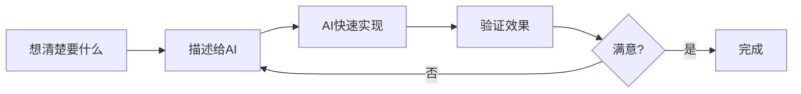

<!-- _class: lead -->
# AI协同：工作方式的革命

**用AI重塑前端开发**

分享人：[你的名字]
日期：2025年11月7日

---

# 我们的工作方式正在改变

**5年前**
- 搜索 Google/Stack Overflow
- 复制粘贴代码
- 自己调试修改

**今天**
- 和 AI 对话
- AI 生成完整方案
- 我们验证和把控方向

> 这不是工具的升级，是**工作范式的转变**

---

# 传统 vs AI协同

| 传统开发流程 | AI协同流程 | 效率提升 |
|------------|-----------|---------|
| 📝 写需求文档（1天） | 💬 对话描述需求（10分钟） | **12x** |
| 💻 编写代码（2天） | 🤖 AI生成代码（5分钟） | **100x** |
| 🐛 调试修复（1天） | 👀 验证+AI修复（30分钟） | **16x** |
| 📄 编写文档（半天） | 📋 AI生成文档（5分钟） | **50x** |

**总计：4.5天 → 1小时**

---

# 核心思想一：AI是协作者，不是工具

## 🔧 传统工具思维
"我用Photoshop画图" → 我控制每一个细节

## 🤝 AI协作思维
"我和设计师一起做设计" → 我提方向，他执行，我验证

### AI = 你的初级助手
- 需要你的指导和反馈
- 会犯错，需要你检查
- 可以快速改进
- **你的价值 = 方向把控 + 质量验证**

---

# 核心思想二：设计先行，执行交给AI

**关键转变**：
- ❌ 边做边想（容易返工）
- ✅ 先想清楚再让AI做（一次做对）

---

# 核心思想三：持续对话，持续优化

## 不是"一次性命令"，而是"持续交流"

**第1轮对话**："帮我做一个登录页面"
→ AI生成初版

**第2轮对话**："这个按钮太小了，背景色改成蓝色"
→ AI调整细节

**第3轮对话**："加上忘记密码功能"
→ AI扩展功能

**第4轮对话**："移动端适配有问题，修复一下"
→ AI优化体验

---

# 实战案例：从需求到上线

## 任务：开发一个活动页面

### 传统方式：3天
1. 产品写需求（半天）
2. 设计出图（1天）
3. 前端开发（1.5天）

### AI协同方式：半天
1. **我**：描述需求给AI（5分钟）
2. **AI**：生成页面初版（2分钟）
3. **我**：提出5个修改意见（10分钟）
4. **AI**：全部调整完成（5分钟）
5. **我**：最终验收通过（10分钟）

**节省时间：87%** → 用于更有创意的工作

---

# 启发：你的岗位可以如何应用？

| 岗位 | 可以让AI协助的工作 | 效率提升 |
|-----|------------------|---------|
| 📊 **产品经理** | 写PRD、画原型、生成测试用例 | 3-5倍 |
| 🎨 **设计师** | 生成初版设计、批量变体、设计系统 | 5-10倍 |
| 📢 **运营/市场** | 写文案、活动方案、数据分析报告 | 5-8倍 |
| 💼 **销售** | 客户提案、竞品分析、话术优化 | 3-5倍 |
| 💻 **技术** | 写代码、写文档、代码审查 | 10-50倍 |

### 💡 思考：你每天的工作中，哪些是重复性的？

---

# 公司层面的机会

## 从个人效率到组织变革

### 1️⃣ 小团队，大能量
- 3个人的团队可以完成之前10个人的工作量
- 更快响应市场变化

### 2️⃣ 快速试错，降低成本
- 想法验证从2周缩短到2天
- 失败成本降低90%

### 3️⃣ 人的时间投入到更有价值的事
- ❌ 重复性工作 → AI
- ✅ 创意、决策、沟通 → 人

---

# 最后想说的

## ⚠️ AI不是万能的
- 会出错（需要你验证）
- 不懂业务（需要你指导）
- 没有创意（需要你提供方向）

## 🚀 但掌握AI协同的人，会远超不掌握的人

**问题**：
- 你最担心AI什么？
- 你最期待用AI做什么？

---

<!-- _class: lead -->
# 谢谢大家！

## Q & A

**Contact**
- 有问题随时找我交流
- 内部可建立AI协同实践小组

**拥抱变化，持续学习**
